import { Picture } from "astro:assets";
import { Toc } from "../../components/toc.tsx";
import { TocItem } from "../../components/toc-item.tsx";
import { RelatedPost } from "../../components/related-post.tsx"

import * as jsExecutePython from "./JavaScriptからPythonを実行する.mdx"

export const heading100 = "お名前.comで独自ドメインを取得する";
export const heading200 = "Netlifyで設定を行う";
export const heading300 = "お名前.comで設定を行う";
export const heading400 = "独自ドメインが適用されたか確認する方法";
export const heading500 = "まとめ";

「お名前.comで取得した独自ドメインをNetlifyのカスタムドメインとして使いたい」

という要望にお答えします。

<RelatedPost slug={jsExecutePython.frontmatter.slug} title={jsExecutePython.frontmatter.title} />

この記事を書いている僕は、実際にお名前.comで取得した独自ドメインをNetlifyのカスタムドメインとして適用したサイトを運営しています。具体的には「<a href="https://ralafy.com" target="_blank" rel="nofollow noopener">Ralafy</a>」というサイトです。

<a href="https://ralafy.com" target="_blank" rel="nofollow noopener">{`>> Ralafyを見てみる`}</a>

この記事では以下を解説します。

- お名前.comで独自ドメインを取得する方法
- Netlifyでどんな設定をすればいいか
- お名前.comでどんな設定をすればいいか

<Toc client:load>
	<TocItem>[{heading100}](#heading100)</TocItem>
	<TocItem>[{heading200}](#heading200)</TocItem>
	<TocItem>[{heading300}](#heading300)</TocItem>
	<TocItem>[{heading400}](#heading400)</TocItem>
	<TocItem>[{heading500}](#heading500)</TocItem>
</Toc>

## {heading100}

まず、お名前.comで独自ドメインを取得します。

具体的な取得方法を知りたい方は、以下の記事をどうぞ。先ほど紹介したRalafyで解説しております。

<a href="https://ralafy.com/blog/get-onamae-domain/" target="_blank" rel="nofollow noopener">{`>> 【お名前.com】独自ドメイン取得の手順を解説 - Ralafy`}</a>

## {heading200}

Netlifyのサイトにアクセスし、ログインしてください。

<a href="https://www.netlify.com/" target="_blank" rel="nofollow noopener">{`>> Netlifyのサイトへ`}</a>

トップページに表示されている「**Sites →**」の中から、独自ドメインを適用させたいサイトを選んでクリックします。

<figure>
  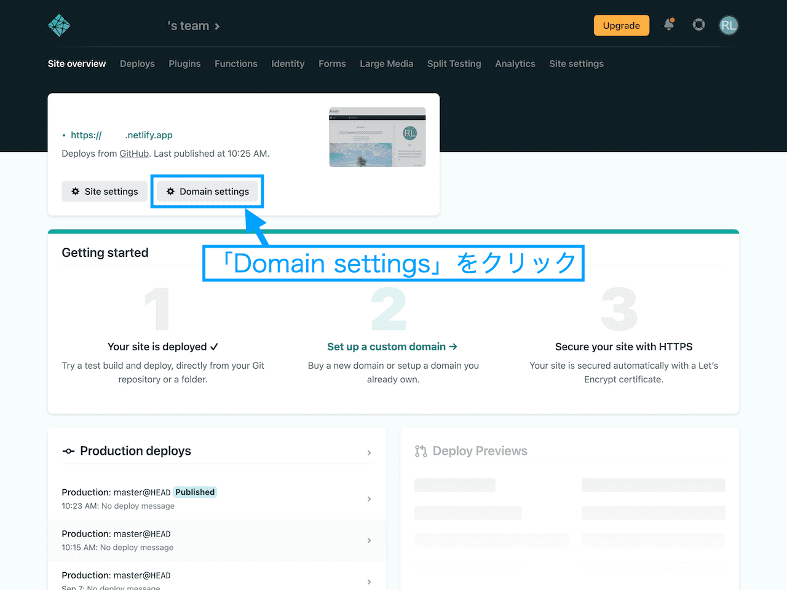
</figure>

↑「**Domain settings**」をクリックします。

<figure>
  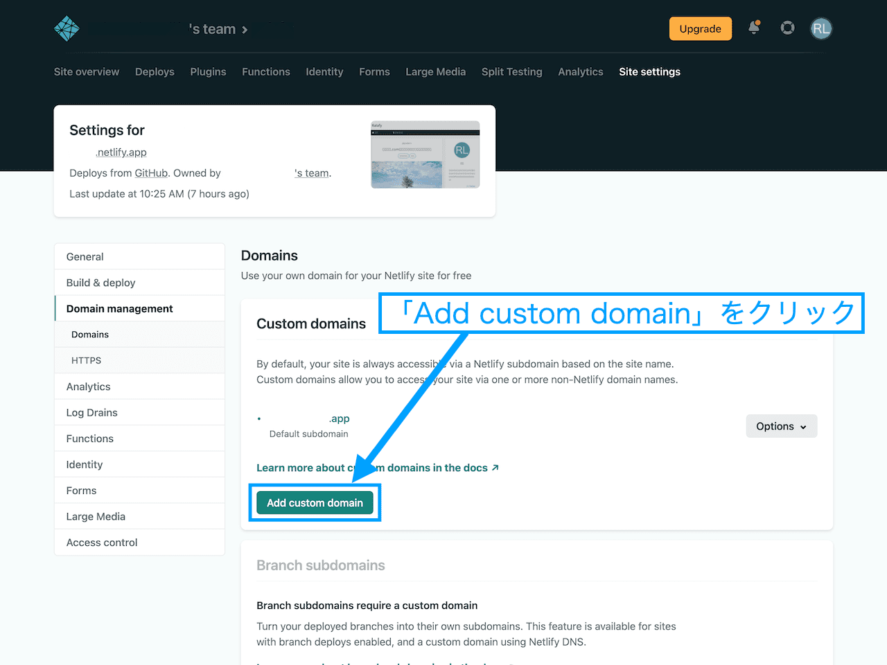
</figure>

↑「**Custom domains**」の中の、「**Add custom domain**」をクリックします。

<figure>
  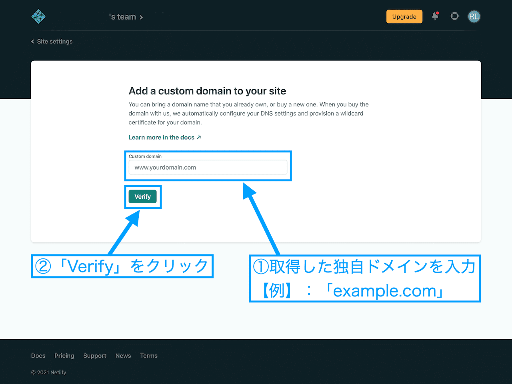
</figure>

↑「**Custom domain**」のところに、**お名前.comで取得した独自ドメイン**を入力します。入力したら「**Verify**」をクリックします。

<figure>
  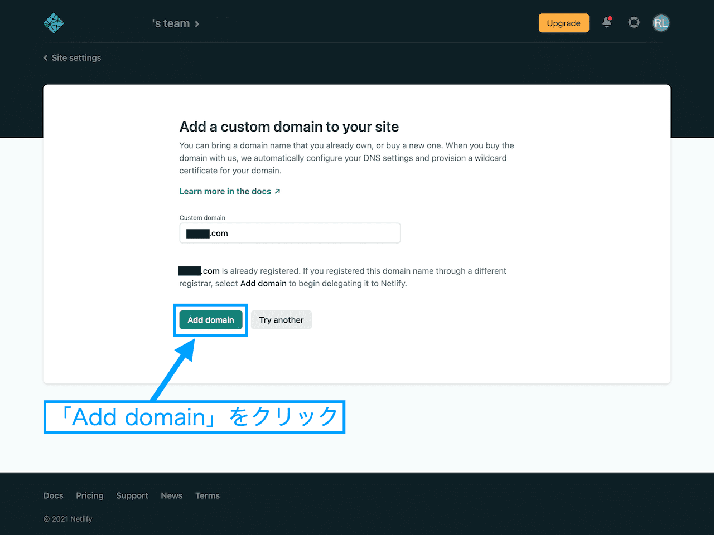
</figure>

↑下の方に「**Add domain**」というボタンが出現するので、クリックします。

<figure>
  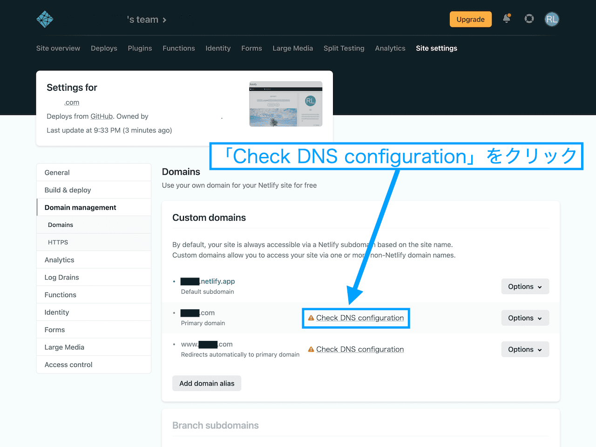
</figure>

↑「**Domain management**」のページが開きます。以下の2つが自動で登録されているかと思います。

- 「www」なしのドメイン
- 「www」ありのドメイン

**「www」なしのドメイン**の方が、「**Primary domain**」として登録されます。「Primary domain」の「**Check DNS configuration**」をクリックしてください。

<figure>
  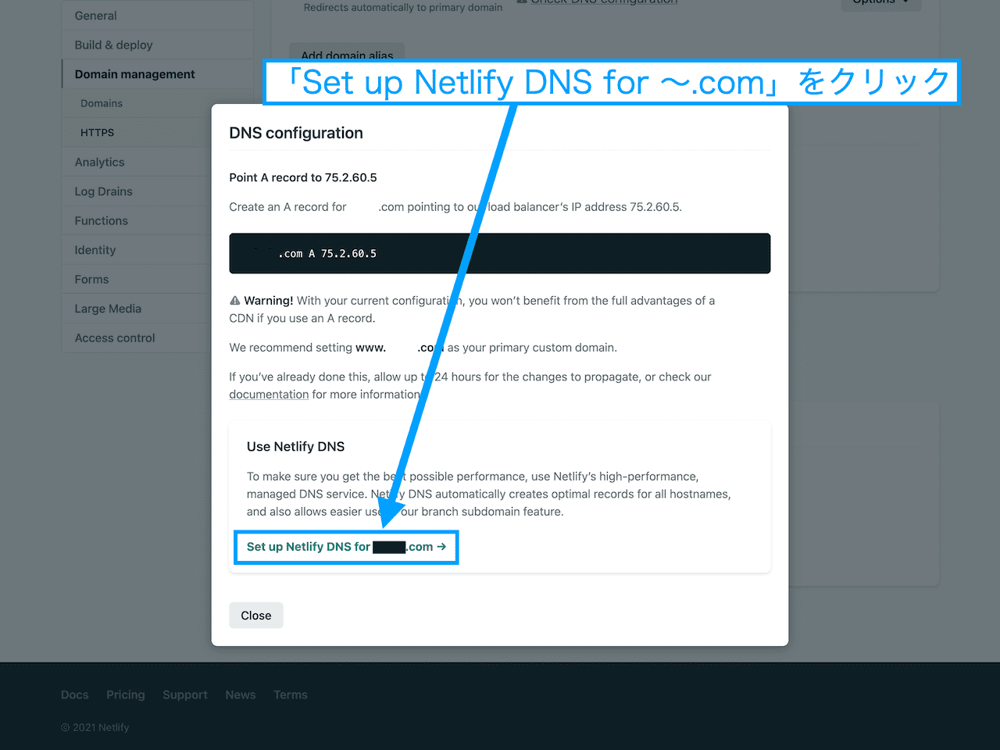
</figure>

↑「**Set up Netlify DNS for 〜.com**」をクリックします。

<figure>
  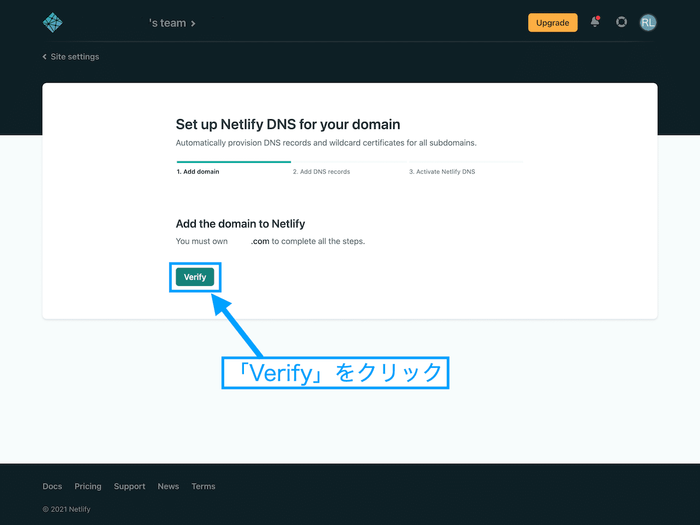
</figure>

↑「**Verify**」をクリックします。

<figure>
  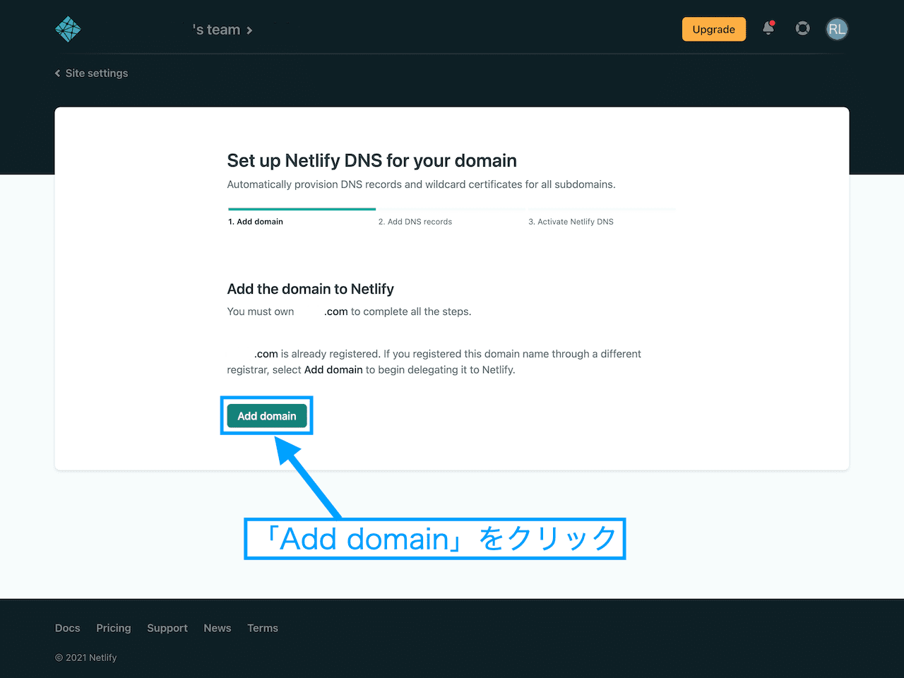
</figure>

↑「**Add domain**」というボタンが出現するので、クリックします。

<figure>
  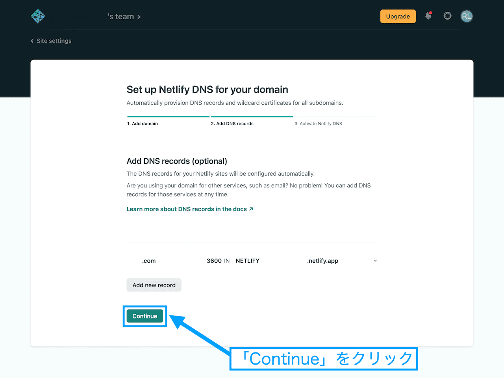
</figure>

↑「**Continue**」をクリックします。

<figure>
  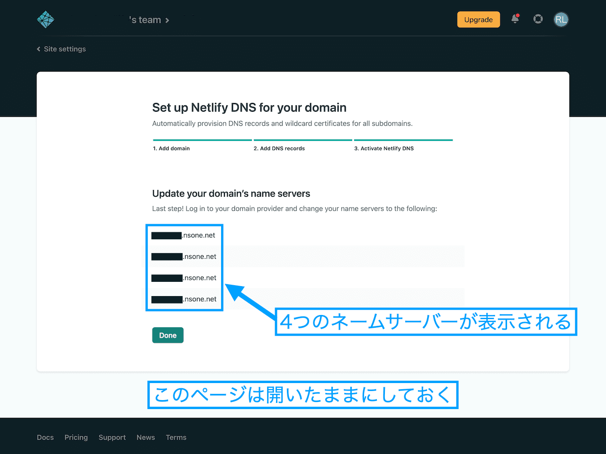
</figure>

↑4つの**ネームサーバー**が表示されます。

これらのネームサーバーは、この後お名前.comで設定を行うときに使います。そのためこのページは**開いたままにしておく**か、4つのネームサーバーをどこかにメモしておいてください。

これで、Netlifyで行う設定は以上です。

## {heading300}

次は、お名前.comで設定をしていきます。まず、お名前.comのサイトにログインしてください。

<a href="https://www.onamae.com/navi/login/" target="_blank" rel="nofollow noopener">{`>> お名前.com Naviログイン`}</a>

<figure>
  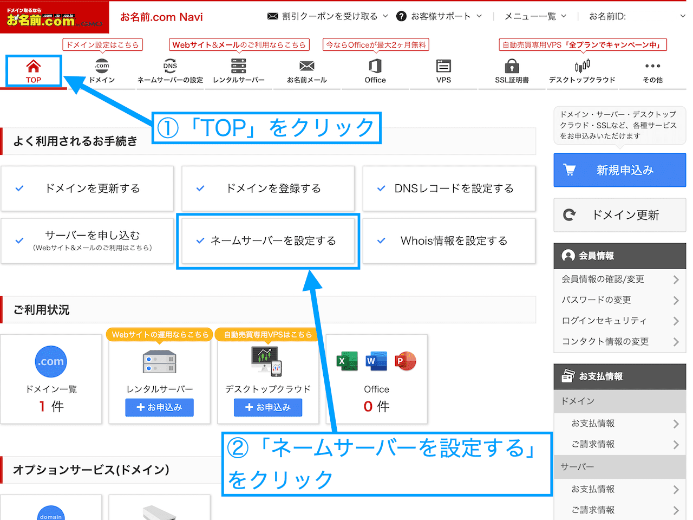
</figure>

①「**TOP**」をクリックします。

②次に「**ネームサーバーを設定する**」をクリックしてください。

<figure>
  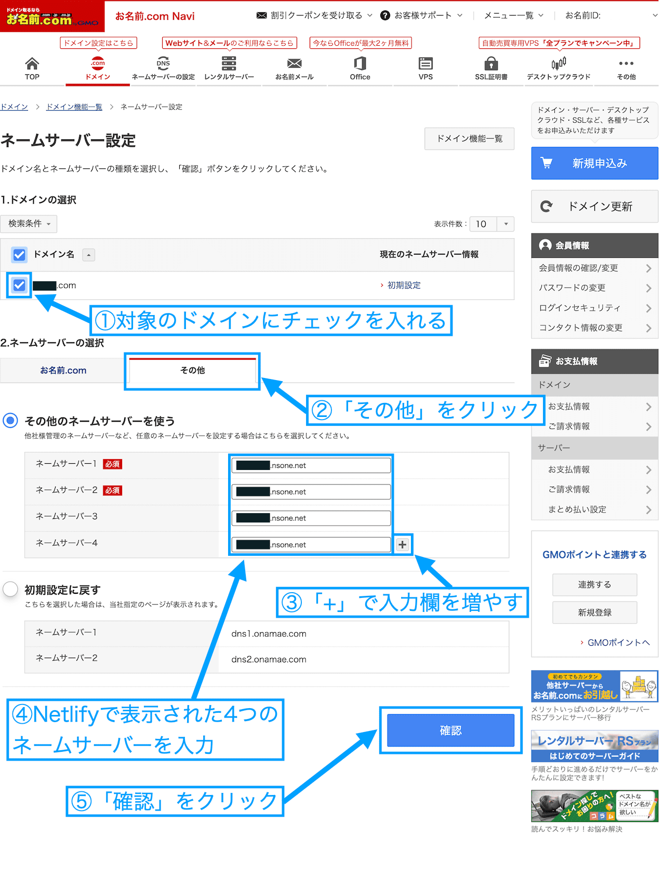
</figure>

①対象のドメインにチェックを入れます。

②「ネームサーバーの選択」では「その他」のタブをクリックしてください。

③入力欄が4つになるように「+」ボタンをクリックします。

④入力欄には、Netlifyで表示された4つのネームサーバーを入力してください。

⑤最後に、「確認」をクリックします。

<figure>
  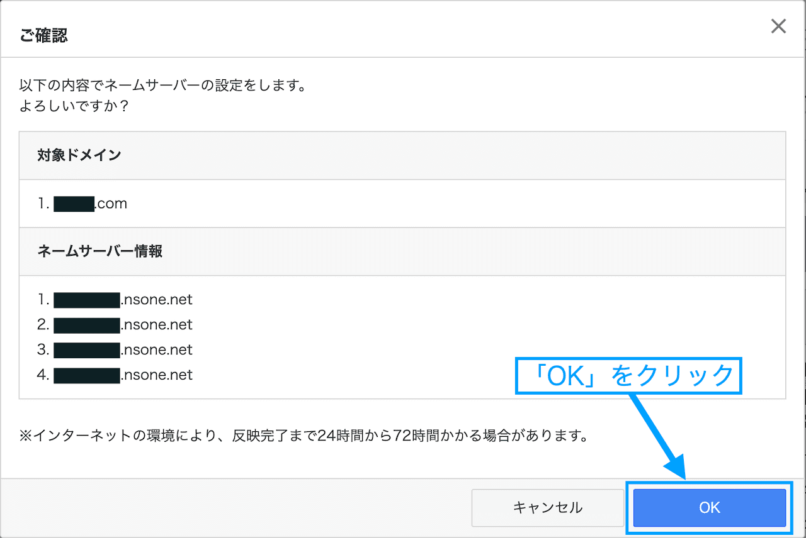
</figure>

↑内容を確認して、「OK」をクリックしてください。これで、お名前.comで行う設定は以上です。反映までには24時間から72時間かかる場合があるとのこと。

僕の場合、**2時間ほど**で設定が反映されました。

## {heading400}

最後に、Netlifyに独自ドメインが適用されたか確認する方法を解説します。

Netlifyで4つのネームサーバーが表示されたページを開いている方は、下部の「**Done**」をクリックしてください。

<figure>
  
</figure>

↑4つのネームサーバーが表示されたページを閉じた方は、このページで「**Domain settings**」をクリックします。

<figure>
  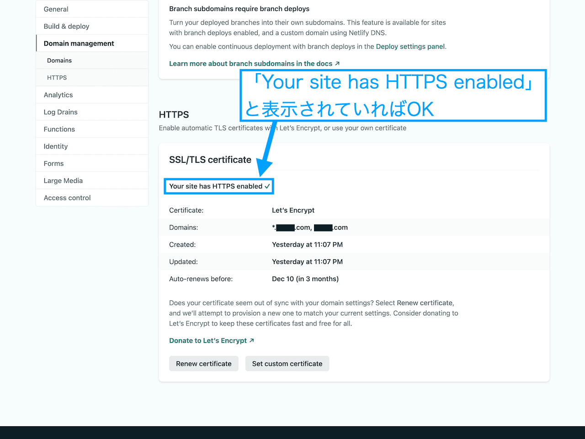
</figure>

↑「Domains」のページが開きます。一番下までスクロールしてください。「HTTPS」のところに、「Your site has HTTPS enabled」と表示されていれば完了です。

Netlifyに独自ドメインを適用し、https化までできました。適用した独自ドメインでサイトにアクセスできるようになっているかと思います。

## {heading500}

Netlifyにお名前.comで取得した独自ドメインを適用する方法を解説しました。最後にもう一度手順をまとめます。

- お名前.comで独自ドメインを取得する
- Netlifyで設定を行う
- お名前.comで設定を行う
- 独自ドメインが適用されたか確認する

というわけで、記事は以上です。
import type { RelatedPost } from "@components/related-post"
import type { RelatedPost } from "@components/related-post"

