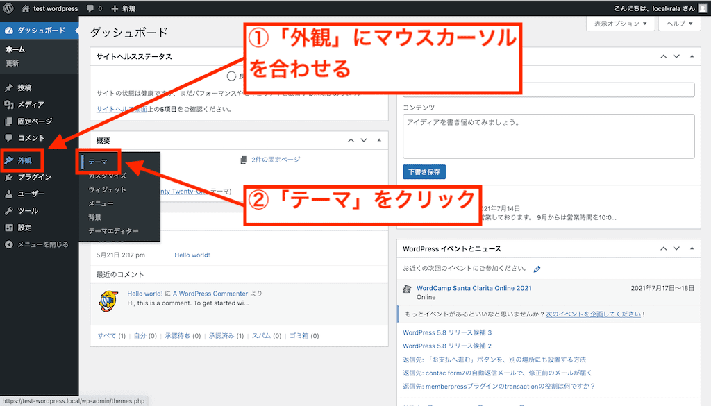
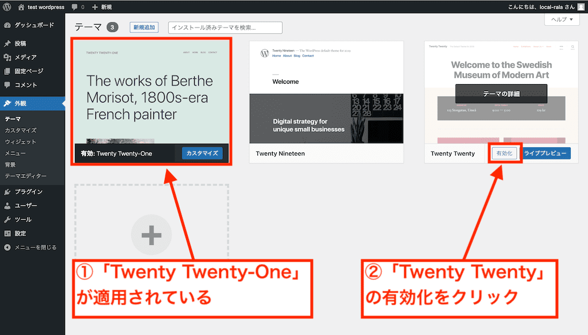
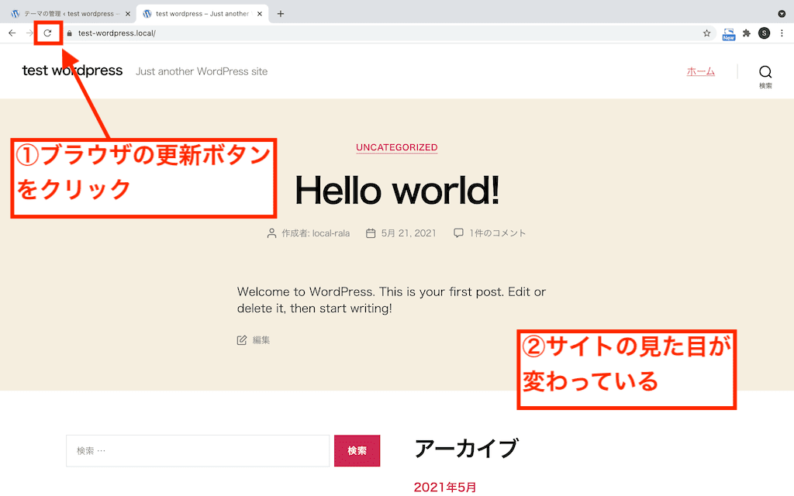

import { Toc } from "../../components/toc.tsx";
import { TocItem } from "../../components/toc-item.tsx";

export const heading100 = "WordPressの「テーマ」とは";
export const heading200 = "「テーマ」を変更する方法";

「WordPressサイトの**テーマ**を変えたい」といった要望にお答えします。

この記事では、WordPressサイトで「**テーマ**」を変更する方法を解説します。テーマを変更することで、WordPressサイトの見た目が変わります。

<Toc client:load>
	<TocItem>[{heading100}](#heading100)</TocItem>
	<TocItem>[{heading200}](#heading200)</TocItem>
</Toc>

## {heading100}

WordPressサイトの見た目を決める**テンプレート**のようなものです。

WordPressのテーマを変更すると、**サイトのデザイン**が変わります。デザインが変わると、文字や画像などの配置が変わります。

WordPressのテーマは無料だったり有料だったりします。無料のテーマでも十分なサイトを作れるのが、WordPressの魅力です。

## {heading200}

<figure>
  
</figure>

↑管理画面左側の「**外観**」にマウスカーソルを合わせます。いくつか項目が出てきますので、「**テーマ**」をクリックします。

<figure>
  
</figure>

↑こちらの例では、「**Twenty Twenty-One**」というテーマが適用されている状態です。「**Twenty Twenty**」にマウスカーソルを合わせると、「**有効化**」のボタンが表示されるのでクリックします。

これでテーマが変更されました。

<figure>
  
</figure>

↑サイトを開いている場合は更新ボタンをクリックします。サイトの見た目が変わっているのがわかります。

というわけで、記事は以上です。