import { Picture } from "astro:assets";
import { Toc } from "../../components/toc.tsx";
import { TocItem } from "../../components/toc-item.tsx";

export const heading100 = "Getformとは";
export const heading200 = "Getformのアカウントを作る";
export const heading300 = "エンドポイントを作る";
export const heading400 = "コードの書き方";
export const heading500 = "お問い合わせを送信してみる";
export const heading600 = "いくつ受信できるの？";
export const heading700 = "まとめ";

今回は「Getform」というサービスの使い方を解説します。

<Toc client:load>
	<TocItem>[{heading100}](#heading100)</TocItem>
	<TocItem>[{heading200}](#heading200)</TocItem>
	<TocItem>[{heading300}](#heading300)</TocItem>
	<TocItem>[{heading400}](#heading400)</TocItem>
	<TocItem>[{heading500}](#heading500)</TocItem>
	<TocItem>[{heading600}](#heading600)</TocItem>
	<TocItem>[{heading700}](#heading700)</TocItem>
</Toc>

## {heading100}

「**Getform**」は、WebサイトやWebアプリに簡単にフォーム送信を実装できるサービスです。

<p><a href="https://getform.io/" target="_blank" rel="nofollow noopener">>> 「Getform」の公式サイトを見てみる</a></p>

サーバーの設定とか難しいバックエンドの作成も不要。

今回は、例としてHTMLのみでGetformを使ってお問い合わせフォームを作る方法を解説します。

HTMLのみなので、WordPressだろうがReactだろうが実装できてしまいます。

<figure>
  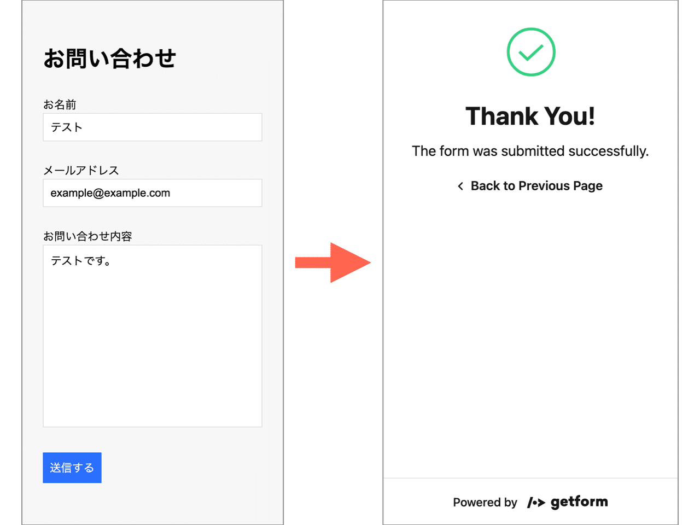  
</figure>

↑今回作るお問い合わせフォームの完成イメージが上の画像の通り。

本番環境にデプロイする必要もなく、localhost環境で動作を確認できるのもメリットです。

また、Getformは「無料プラン」と「有料プラン」があります。今回作るお問い合わせフォームは、**無料プラン**のみで実装していきます。

## {heading200}

まずはアカウントの作り方から解説します。

以下のリンクにアクセスします。

<p><a href="https://getform.io/" target="_blank" rel="nofollow noopener">>> Getformのアカウントを作る</a></p>

<figure>
  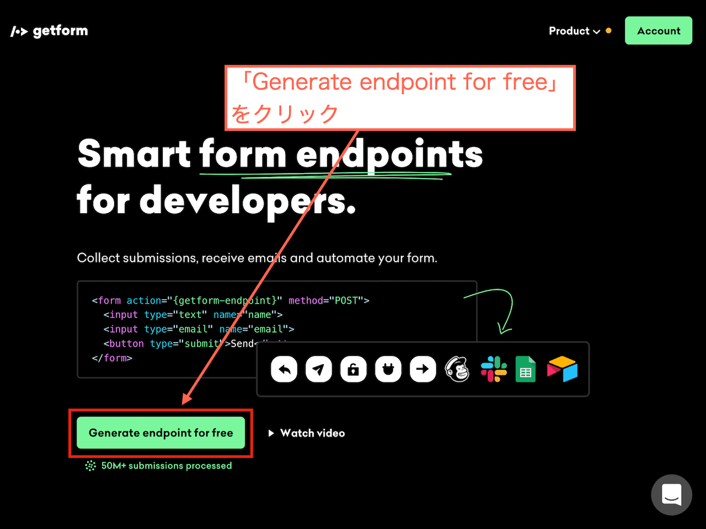
</figure>

↑上記のページが開きます。「**Generate endpoint for free**」をクリックします。

<figure>
  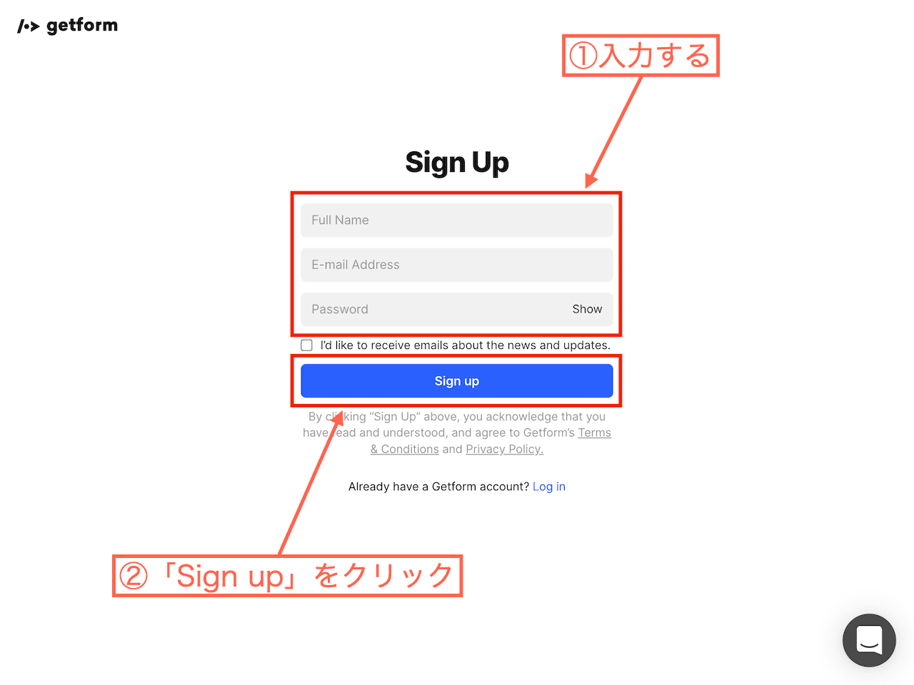
</figure>

以下の3つを入力します。

- 名前
- メールアドレス
- パスワード

入力したら「**Sign up**」をクリックします。

<figure>
  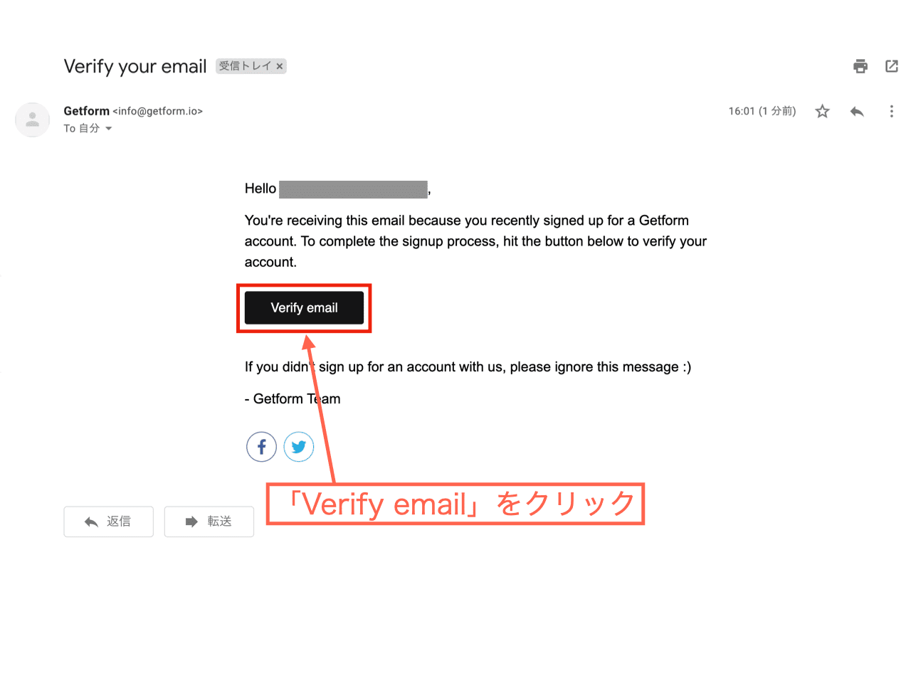
</figure>

↑登録したメールアドレスの受信トレイを確認してみましょう。上記のようなメールが届きます。「**Verify email**」をクリックします。

Getformのサイトが開いて、アカウント作成は完了です。

## {heading300}

アカウントを作ったら、今度は**エンドポイント**を作ります。「エンドポイント」はIT用語なんですが、ここでは「フォームから送信されてくる情報の受信ボックスみたいなもの」と考えていいと思います。

Getformの無料プランでは、作れるエンドポイントは**1つのみ**です。

<figure>
  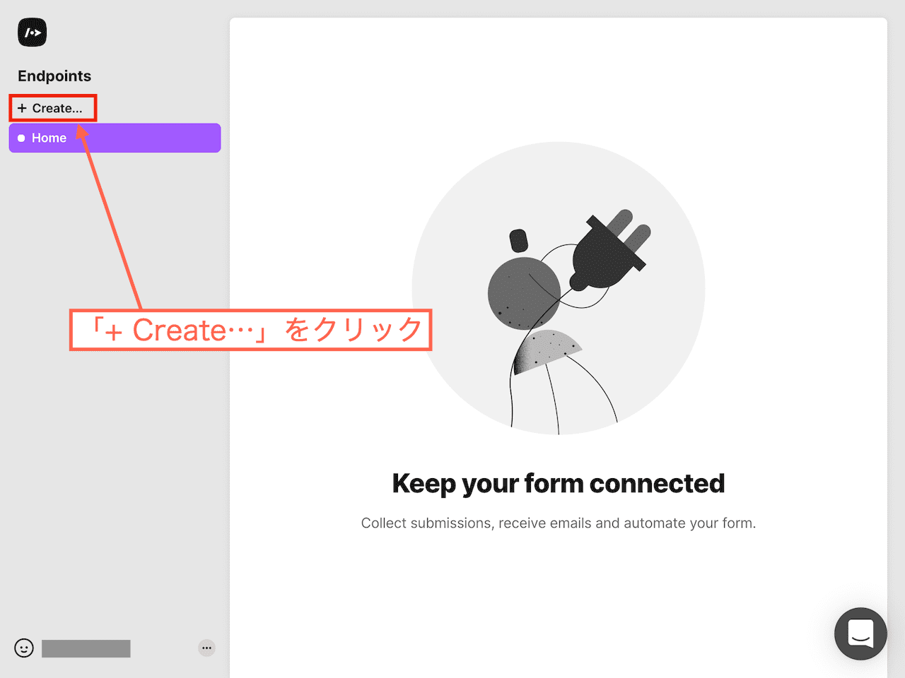
</figure>

↑この画面で、「+ Create...」をクリックします。

<figure>
  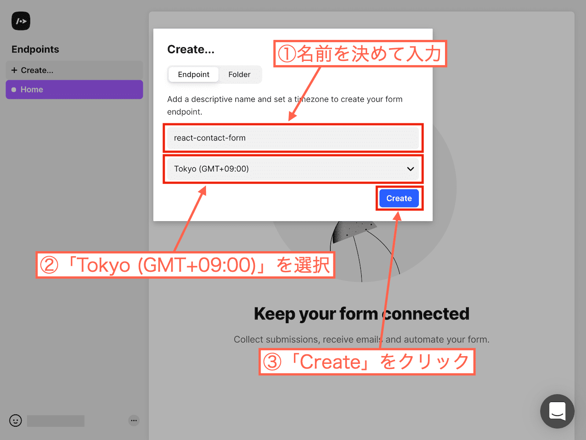
</figure>

以下の2つを決めます。

- エンドポイントの名前
- タイムゾーン

ここでは、以下のようにしました。

- エンドポイントの名前: react-contact-form
- タイムゾーン: Tokyo (GMT+09:00)

入力したら「**Create**」をクリックします。

<figure>
  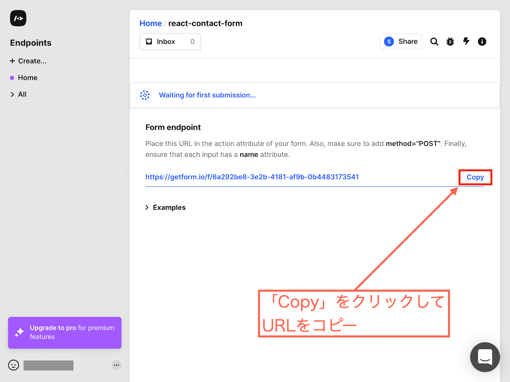
</figure>

↑エンドポイントが作られました。**エンドポイントのURL**が表示されているので、コピーしておきます。

そして、このページは開いたままにしておきましょう。

## {heading400}

HTMLで以下のようなコードを書けば、お問い合わせフォームは完成です。

<div class="code-title">html</div>

```html
<div className="container">
  <h1>お問い合わせ</h1>
  <!-- ↓コピーしたエンドポイントのURLを貼り付ける -->
  <form
    action="https://getform.io/f/6a292be8-3e2b-4181-af9b-0b4483173541"
    method="POST"
  >
    <div>
      <label for="name">お名前</label>
      <input name="name" type="text" required />
    </div>
    <div>
      <label for="email">メールアドレス</label>
      <input name="email" type="email" required />
    </div>
    <div>
      <label for="content">お問い合わせ内容</label>
      <textarea name="content" type="text" rows="10" required></textarea>
    </div>
    <button type="submit">送信する</button>
  </form>
</div>
```

今回は以下の項目を入力するように作りました。

- お名前
- メールアドレス
- お問い合わせ内容

項目は自由に変えられます。

formタグに「**action**」と「**method**」を指定しています。actionには、先ほどコピーしたエンドポイントのURLを指定すればオッケー。

上記のコードにあるエンドポイントのURLは、あくまで例なので使用できません。必ず、ご自分のエンドポイントのURLを貼り付けてください。

cssはお好みで構いませんが、今回は以下のようにしました。

<div class="code-title">css</div>

```css
* {
  margin: 0;
  padding: 0;
}

body {
  font-family: sans-serif;
  background-color: #f7f7f7;
}

.container {
  display: grid;
  row-gap: 30px;
  width: 84%;
  max-width: 640px;
  margin: 60px auto;
}

form {
  display: grid;
  row-gap: 30px;
}

input,textarea {
  width: 100%;
  box-sizing: border-box;
  border: solid 1px #ddd;
  padding: 10px;
  font-size: 16px;
  outline: none;
  appearance: none;
  border-radius: 0;
  resize: none;
}

button {
  justify-self: start;
  border: none;
  background-color: #0d6efd;
  color: #fff;
  padding: 10px;
  font-size: 16px;
}

button:hover {
  cursor: pointer;
  opacity: 0.7;
}
```

<figure>
  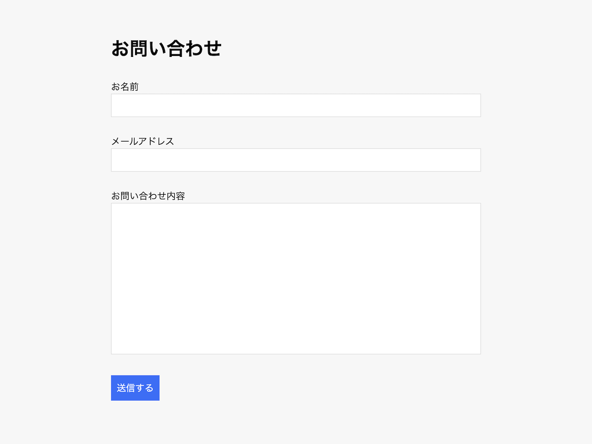
</figure>

↑サイトの見た目はこのようになっているかと思います。

## {heading500}

サイトは実際のネット環境に公開する必要はありません。テスト環境（localhost環境）で動作確認できます。

試しにお問い合わせを送信してみましょう。

<figure>
  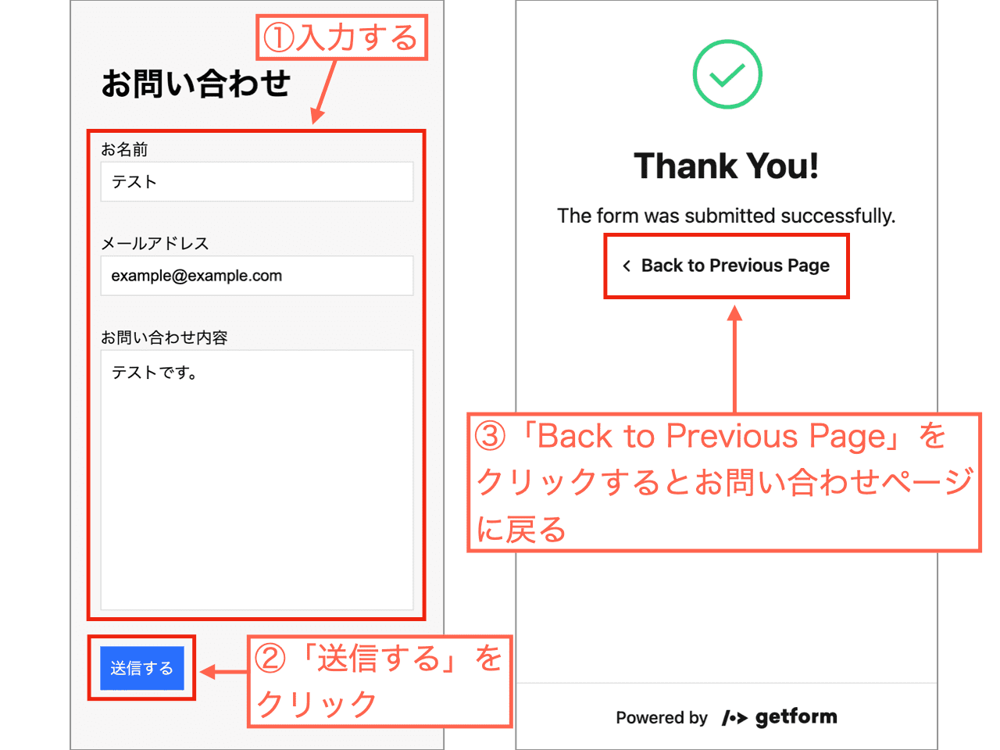
</figure>

↑このように操作します。

- お名前
- メールアドレス
- お問い合わせ内容

上記を入力して「**送信する**」をクリックします。すると、Getformのページが表示されて「Thank You!」というメッセージが出ます。

「Back to Previous Page」をクリックすれば、元のお問い合わせページに戻ります。

<figure>
  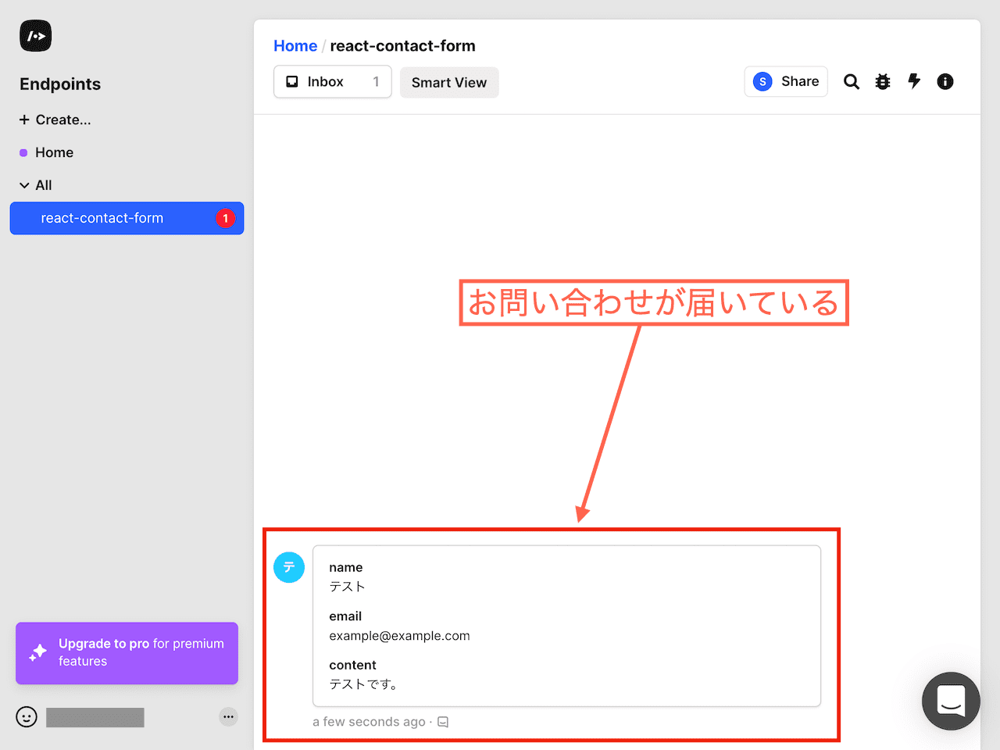
</figure>

↑ここでGetformのマイページを見てみましょう。すると、お問い合わせが1件届いていることがわかります。

先ほど試しに送信してみたお問い合わせですね。

## {heading600}

Getformの無料プランでは、100MBの容量が用意されています。

<p><a href="https://getform.io/pricing" target="_blank" rel="nofollow noopener">>> Getformのプラン内容を見る</a></p>

無料プランの場合、そんなにたくさん受信できるわけではなさそうです。

<figure>
  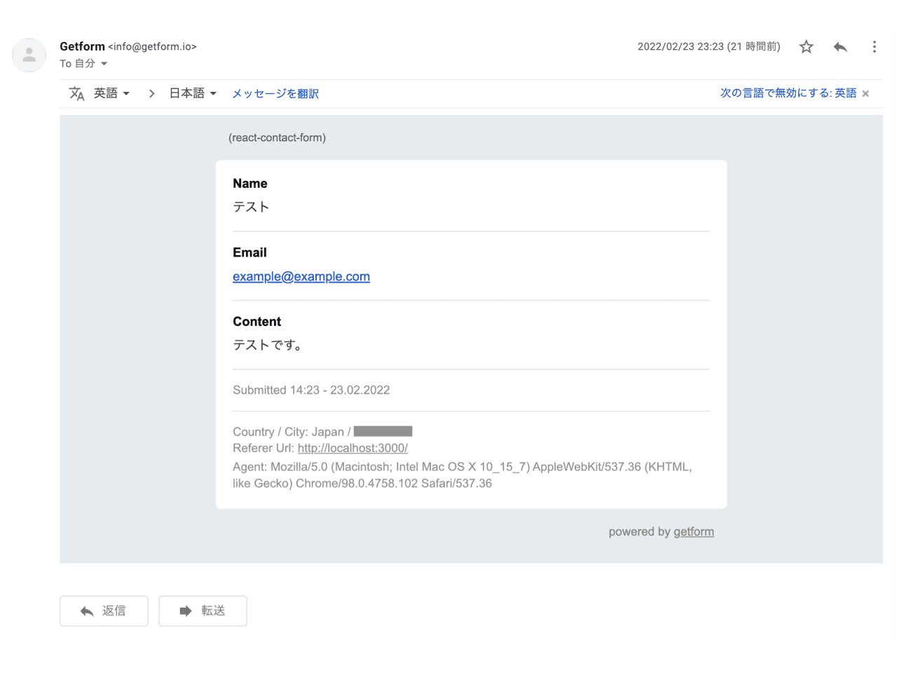
</figure>

↑ただ、Getformに登録した自分のメールアドレス宛てにもお問い合わせ内容は届きます。こっちは保存しておいて、Getformで受信したお問い合わせはこまめに削除する、みたいな運用でもいいかもですね。

## {heading700}

最後に記事をまとめます。

今回は「**Getform**」の使い方を解説しました。

「Getform」を使えば、自分の作ったWebサイトやWebアプリに「**フォーム送信**」を実装できます。**HTMLのコードのみ**で実装できるため、**WordPressで作ったサイト**や**Reactで作ったアプリ**にも実装可能。今回は**お問い合わせフォーム**を作りました。

また、「Getform」は無料プランと有料プランがあります。無料プランのみでお問い合わせフォームを作ることができます。

ただ、無料プランだと**容量が少ない**というデメリットはあります。ですが、お問い合わせ内容は**自分のメールアドレス宛て**にも送られてきます。そっちをメインに保存するという運用もありかもしれません。

というわけで記事は以上です。