import { Picture } from "astro:assets";
import { Toc } from "../../components/toc.tsx";
import { TocItem } from "../../components/toc-item.tsx";
import { TocChildItem } from "../../components/toc-child-item.tsx";
import { RelatedPost } from "../../components/related-post.tsx"
import * as githubRegistration from "./github-registration.mdx";
import * as githubRepositoryPush from "./github-repository-push.mdx";

export const heading100 = "リポジトリとは";
export const heading200 = "GitHubのアカウントを作る";
export const heading300 = "リポジトリを作る";
export const heading300_1 = "PublicとPrivateの違いは？";
export const heading300_2 = "PublicとPrivateを切り替える";
export const heading400 = "リポジトリを削除する";
export const heading500 = "最後に";

この記事では、GitHubリポジトリの作り方を解説します。それに加え、作ったGitHubリポジトリを削除する方法まで解説します。

<Toc client:load>
	<TocItem>[{heading100}](#heading100)</TocItem>
	<TocItem>[{heading200}](#heading200)</TocItem>
	<TocItem>[{heading300}](#heading300)</TocItem>
	<ul>
		<TocChildItem>[{heading300_1}](#heading300_1)</TocChildItem>
		<TocChildItem>[{heading300_2}](#heading300_2)</TocChildItem>
	</ul>
	<TocItem>[{heading400}](#heading400)</TocItem>
	<TocItem>[{heading500}](#heading500)</TocItem>
</Toc>

## {heading100}

GitHubのリポジトリとは、簡単に言えば「**ファイルを保管しておく場所**」です。**プログラミングコードを保管する**のが一般的な使い方かと思います。

コードが自分のパソコンの中にしかない状態だと、色々不便なんです。でも、リポジトリを使うと以下のようなメリットがあります。

- コードのバックアップ場所として使える
- 他の人とコードを共有できる

GitHubのリポジトリは無料で使えます。使わない手はありません。実際、かなり多くの人に利用されています。

というわけで、リポジトリを作っていきましょう。

## {heading200}

まず、GitHubでリポジトリを作るにはGitHubのアカウントを作らないといけません。

まだGitHubのアカウントを持っていない方は、以下の記事をどうぞ。GitHubアカウントの作り方を解説しています。

  <a rel="prefetch" href={`/blog/post/${githubRegistration.frontmatter.slug}/`}><figure><CustomPicture src={`/assets/${githubRegistration.frontmatter.slug}/eyecatch.png`} alt={githubRegistration.frontmatter.title} /></figure><h2>{githubRegistration.frontmatter.title}</h2>
記事を読む
</a>

## {heading300}

GitHubにサインインしてください。

<figure>
  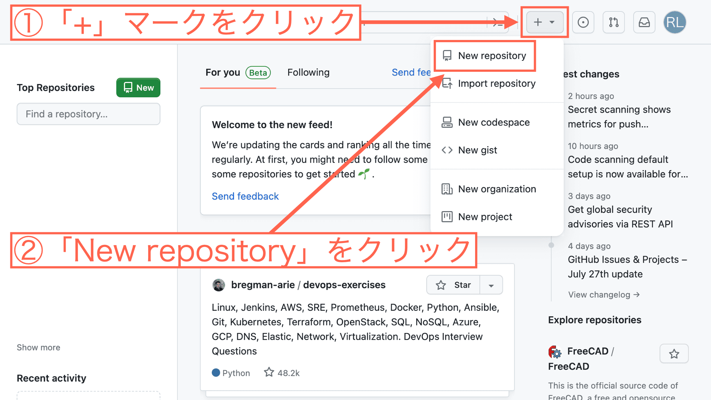
</figure>

↑画面右上の「**+**」ボタンをクリックして、「**New repository**」をクリックしてください。

<figure>
  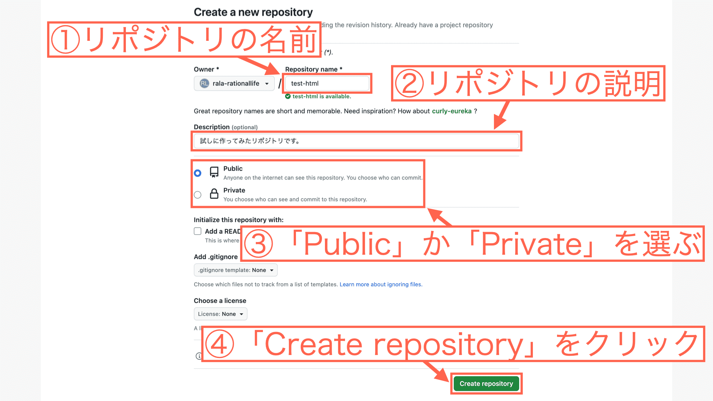
</figure>

リポジトリを作る上で必要な以下の項目を入力します。

- ①リポジトリの名前（ここでは「test-html」としました）
- ②リポジトリの説明（ここでは「試しに作ってみたリポジトリです。」としました）
- ③「Public」か「Private」を選ぶ（後で変えられます）（後ほど解説）
- ④「Create repository」をクリック

これで、リポジトリの作成は完了です。

このように、GitHub上で作ったリポジトリを「**リモートリポジトリ**」と呼びます。

ここまでやっておけば、Gitを使って**GitHubのリモートリポジトリにファイルをpush**することができます。

以下、解説記事です。

  <a rel="prefetch" href={`/blog/post/${githubRepositoryPush.frontmatter.slug}/`}><figure><CustomPicture src={`/assets/${githubRepositoryPush.frontmatter.slug}/eyecatch.png`} alt={githubRepositoryPush.frontmatter.title} /></figure><h2>{githubRepositoryPush.frontmatter.title}</h2>
記事を読む
</a>

ここで「Public」と「Private」について少し深堀りします。

### {heading300_1}

リポジトリを「**Public**」で作った場合は、以下のようになります。

- 自分以外の人もリポジトリの中身を見ることができる
- リポジトリの中身を編集することはできない
- 自分が許可を与えた人だけ、リポジトリの中身を編集できる

リポジトリを「**Private**」で作った場合は、以下のようになります。

- 自分以外、リポジトリの中身を見ることができない
- 自分が許可を与えた人だけ、リポジトリの中身を見たり、編集したりできる

僕の個人的な使い分けとしては、以下のようにしてます。

- リポジトリの中身を見せて、スキルをアピールしたいときなどはPublic
- リポジトリの中身を見せたくないときはPrivate

最初はこんな感じでいいんじゃないかなと。

### {heading300_2}

リポジトリを作るときにPublicかPrivateを決めることになりますが、これは後で変えられます。ただ、PublicからPrivateに切り替えると以下のことが起きます。

- 獲得したスターがなくなる
- 公開しているGitHub Pagesが失われる

リポジトリを作ったばかりのときは、この辺りは気にする必要はありません。ですが、PublicとPrivateを切り替えるときは、上記のことを気にしておいた方がいいかと思います。

では、実際に切り替えてみます。

<figure>
  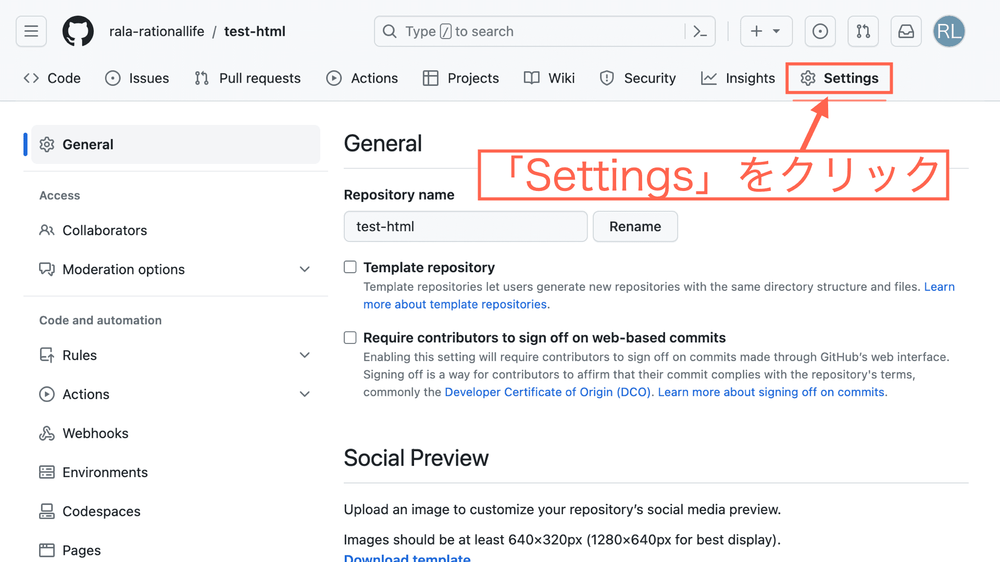
</figure>

↑「**Settings**」をクリックします。

<figure>
  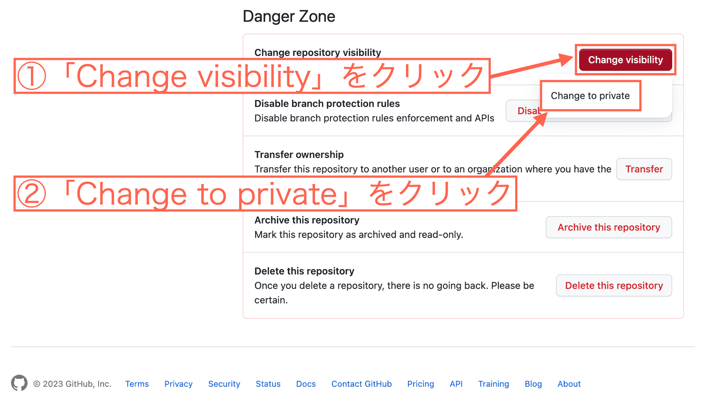
</figure>

↑一番下までスクロールすると、「**Danger Zone**」という部分があります。

その中の「**Change visibility**」をクリックします。そして、「**Change to private**」をクリックしてください。

<figure>
  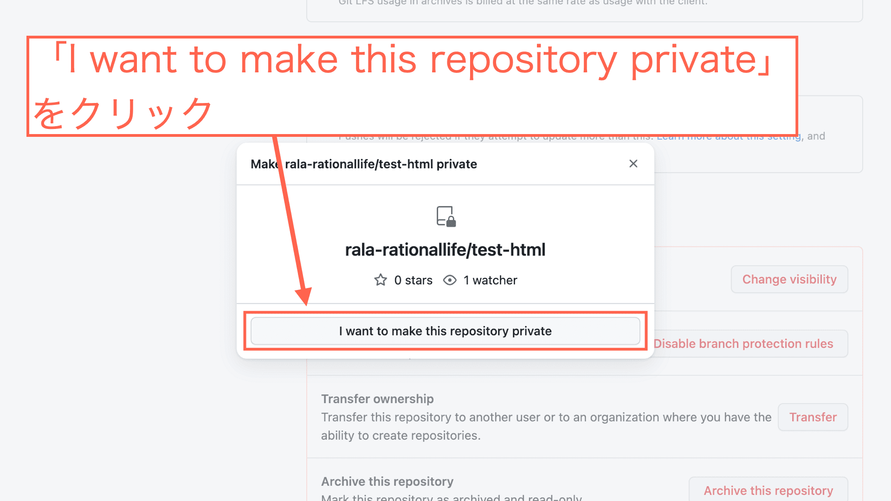
</figure>

↑このような表示になるので、「**I want to make this repository private**」をクリックします。

<figure>
  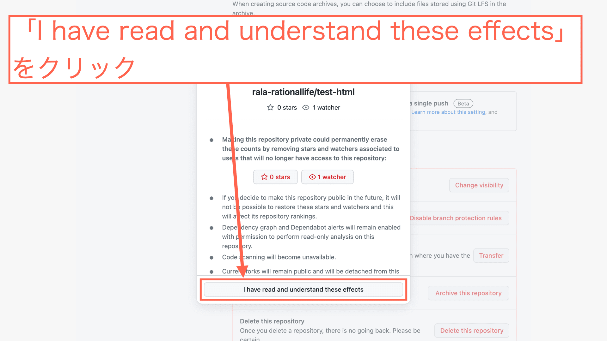
</figure>

↑「publicからprivateに変えるとこんな影響がありますよ」といった注意喚起の文章が表示されます。

確認したら「**I have read and understand these effects**」をクリックします。

<figure>
  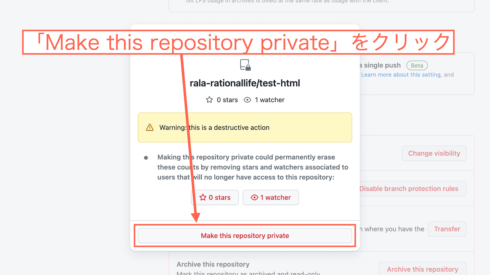
</figure>

↑「**Make this repository private**」をクリックします。

すると、GitHubのパスワードを入力する画面が表示されます。パスワードを入力すれば、リポジトリがPrivateに切り替わります。

## {heading400}

最後に、一度作ったリポジトリを削除する方法を解説します。

リポジトリの削除は**自己責任**で行ってください。一度削除したリポジトリは**元に戻せません**。

<figure>
  
</figure>

↑「**Settings**」をクリックします。

<figure>
  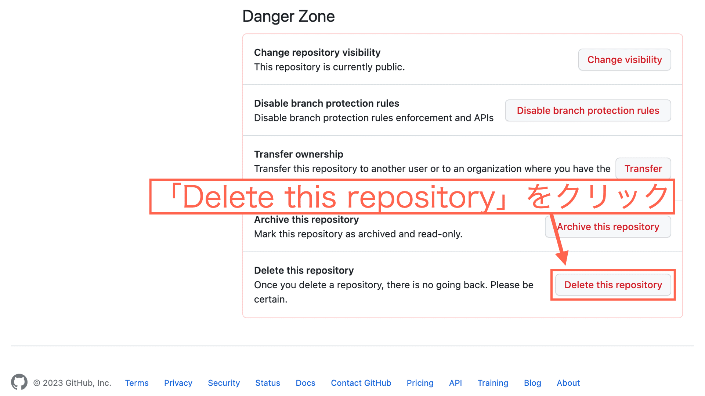
</figure>

↑「**Delete this repository**」をクリックします。

<figure>
  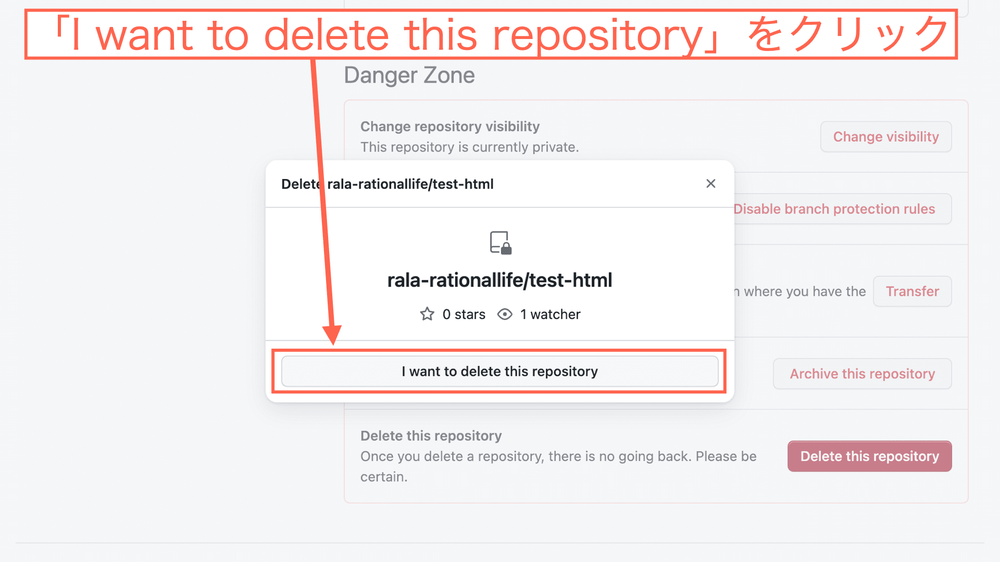
</figure>

↑「**I want to delete this repository**」をクリックします。

<figure>
  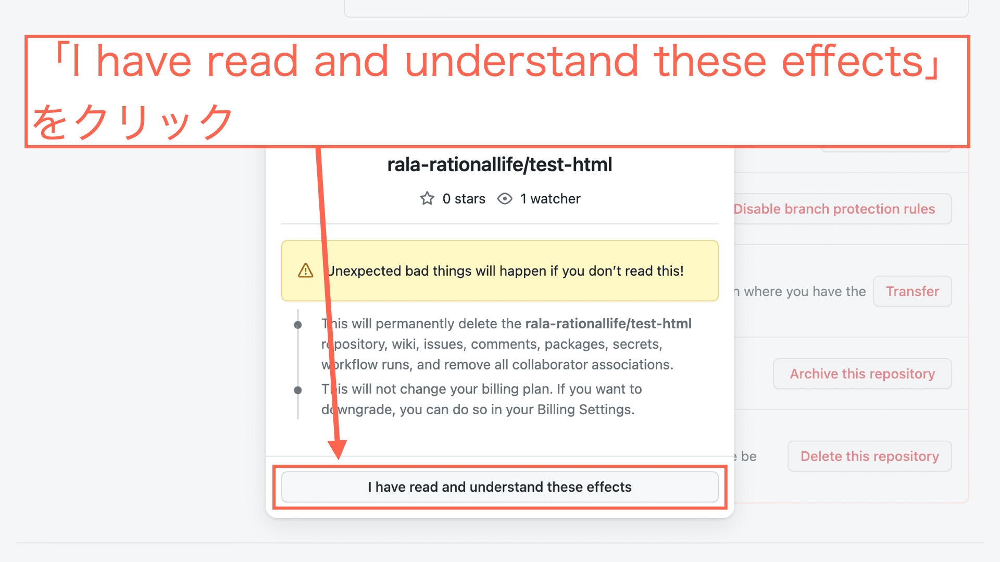
</figure>

↑「**I have read and understand these effects**」をクリックします。

<figure>
  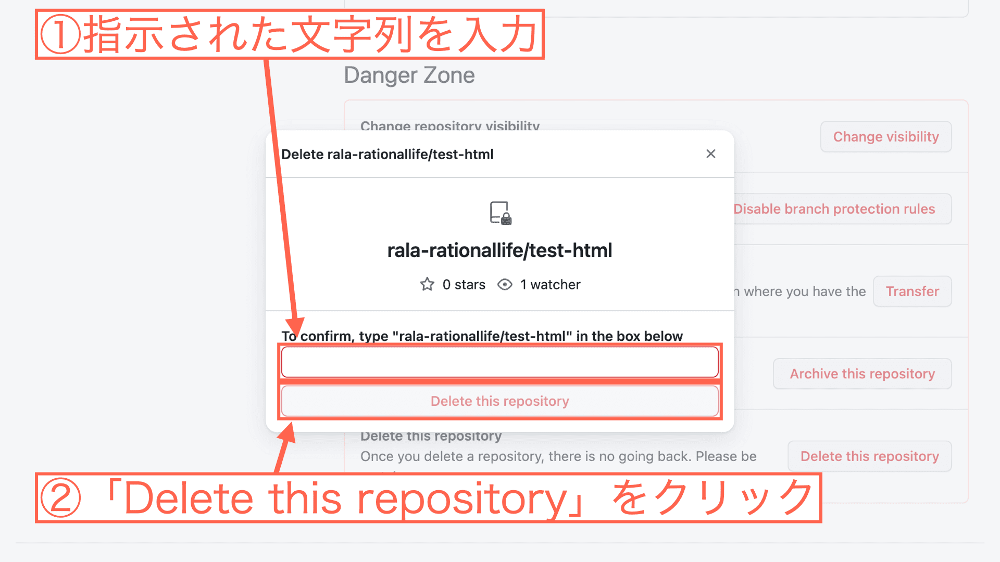
</figure>

↑指示された文字列を入力します。この画像の場合「rala-rationallife/test-html」と入力すればOKです。

入力したら「**Delete this repository**」をクリックします。

すると、GitHubのパスワードを入力する画面が表示されます。パスワードを入力して「Confirm」をクリックすれば、リポジトリが削除されます。

## {heading500}

今回はGitHubでリポジトリを作る方法を解説しました。

GitHubは思った以上に奥が深いです。でもググりながら勉強しているとなんとなく使える気はします。

僕はそうやっていつの間にか非効率なことやっていました。

**GitHubはやはり短期間でサクッと学んだ方がいいです**。

そこで最後に、GitHub初心者におすすめの書籍をご紹介して、記事を終わりたいと思います。ご紹介するのは以下の書籍です。

<a href="https://amzn.to/3OTyN1T" target="_blank" rel="nofollow noopener">改訂2版 わかばちゃんと学ぶ Git使い方入門 [ 湊川 あい ]</a>

**マンガ形式**なのでわかりやすく、短期間でGitHubを学ぶならおすすめです。GitHubを学ぶ上で、「Git」もやはり使いこなさないといけないんですが、この書籍ならGitまでカバーできます。

具体的に僕が「よかった」って思うのは以下の2点です。

- 実際の開発現場では実はこういう風にしてます
- こういうエラーが起きたらこう対処しましょう

この辺りは、なかなか他で手に入らない情報だったりするので、それだけでも価値があります。

というわけで、記事は以上です。