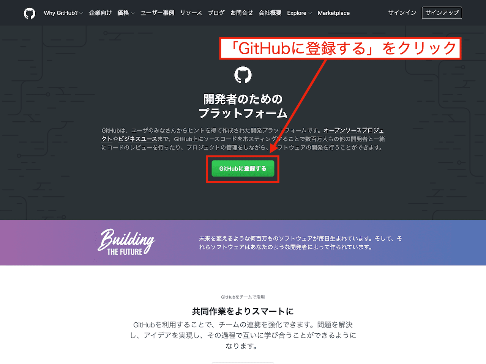
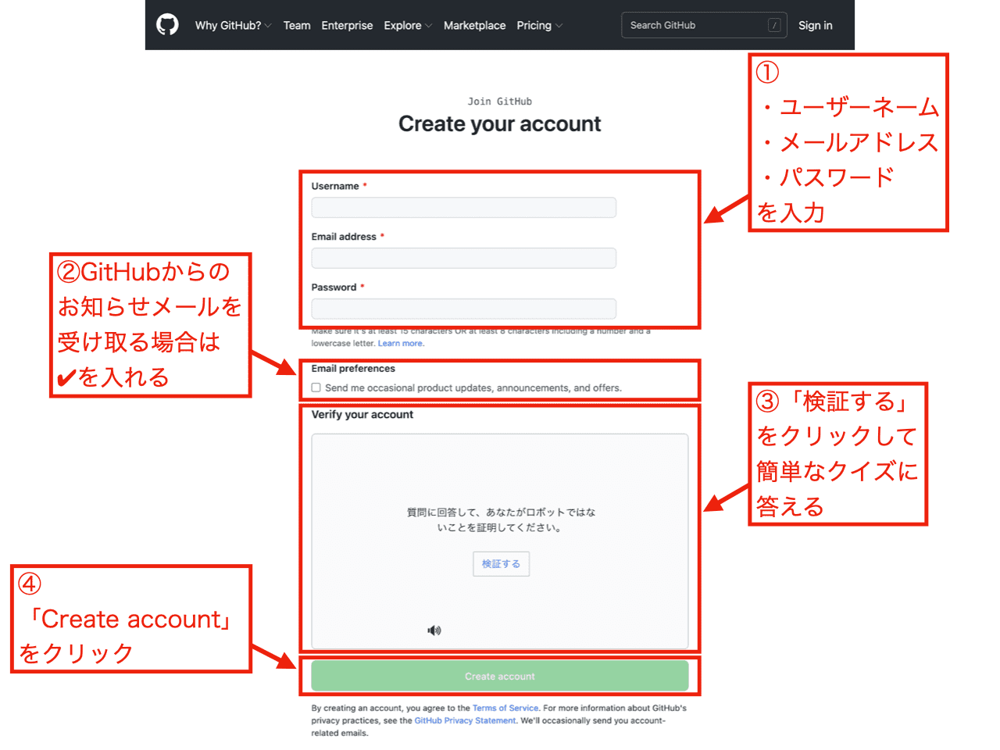
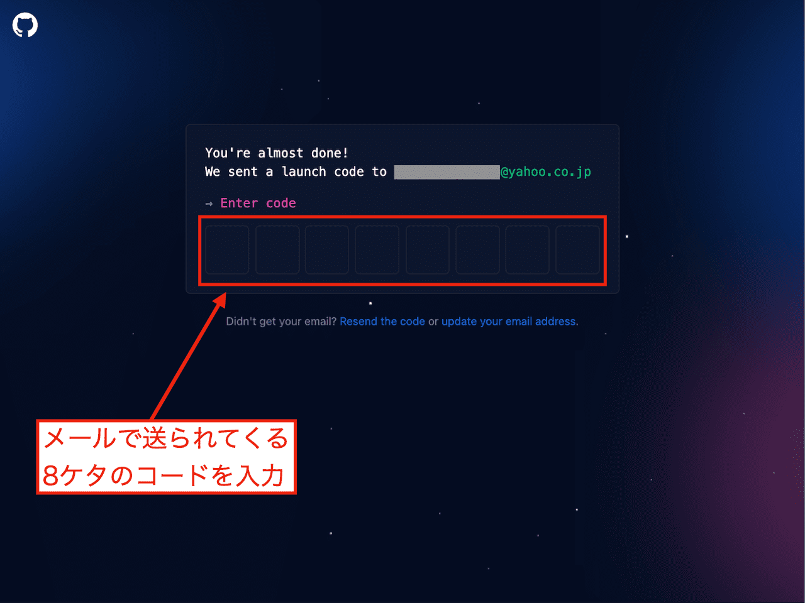
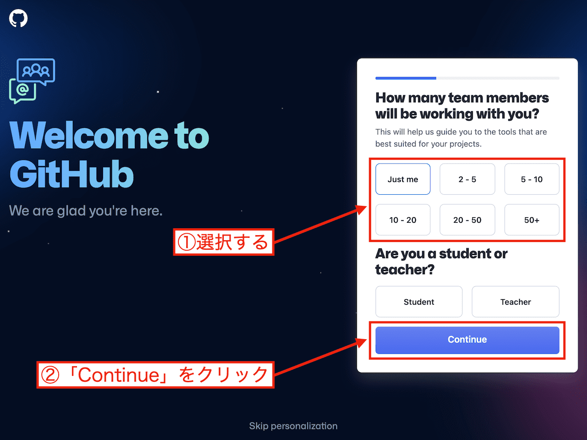
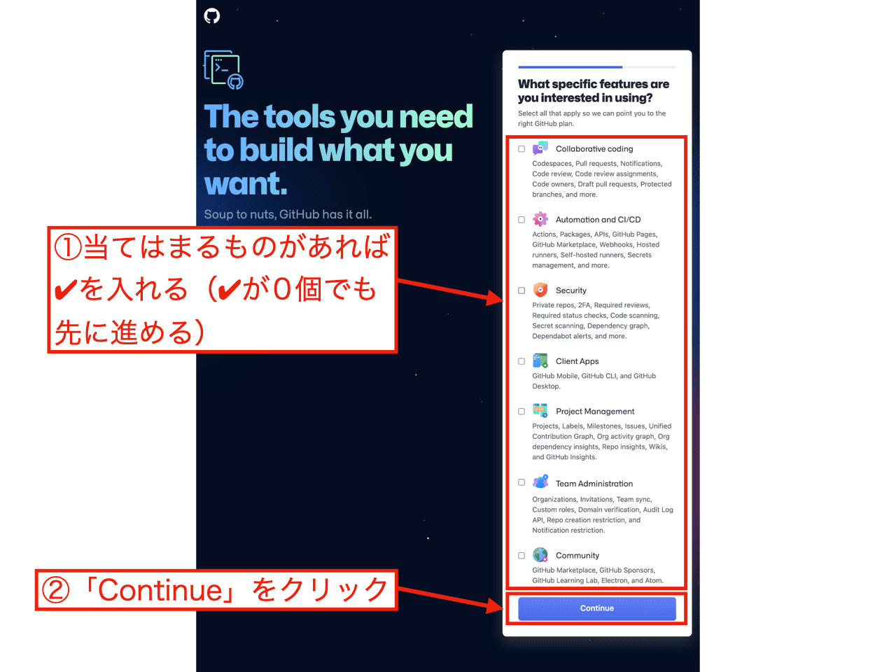
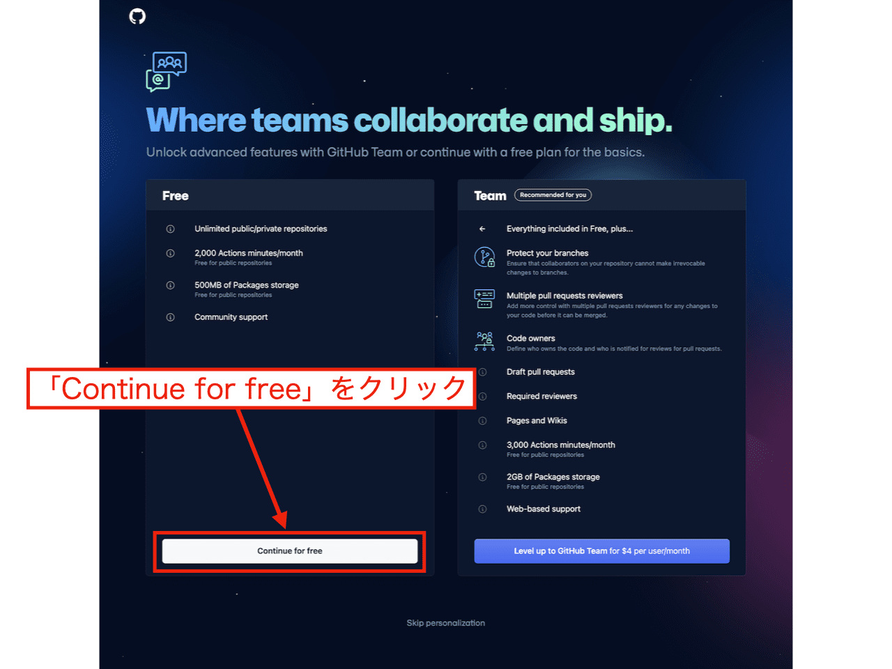
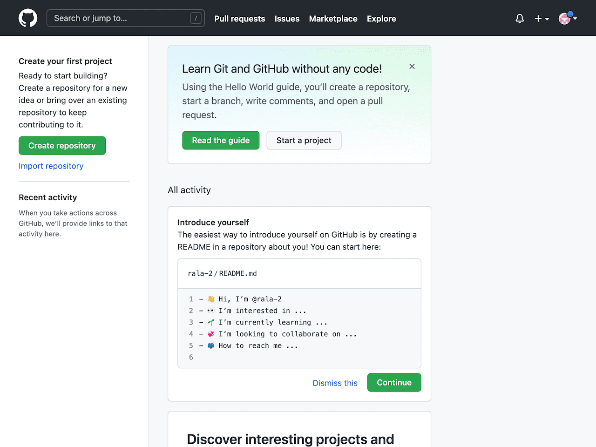

import { Picture } from "astro:assets";
import { Toc } from "../../components/toc.tsx";
import { TocItem } from "../../components/toc-item.tsx";

export const heading100 = "GitHubとは";
export const heading200 = "GitHubの公式サイトにアクセス";
export const heading300 = "必要な情報を入力";
export const heading400 = "認証コードを入力する";
export const heading500 = "アンケートに答える";
export const heading600 = "プランを選ぶ";
export const heading700 = "まとめ";

- 「GitHubのアカウント作成したい」
- 「GitHubの公式サイトが英語でわかりにくい」

上記のお悩みにお答えします。

確かに、GitHubの公式サイトは**全て英語**なので不安ですよね。

この記事では、GitHubのアカウント作成方法を**画像を使って**解説します。 
GitHubの公式サイトが全て英語でも心配ありません。

## {heading100}

GitHubとは、ソースコードをホスティングしてくれるプラットフォームです。

GitHubを使えば、ソースコードを世界中の人に公開したり共有したりできます。 
世界中で使われているため、信頼性もあります。

GitHubは、日本の開発現場でも欠かせないサービスです。 
プログラミング学習するなら、GitHubの使い方を知っておくと役に立ちます。

## {heading200}

まず、GitHubの公式サイトにアクセスします。

<a href="https://github.co.jp/" target="_blank">{`>> GitHubの公式サイトへ`}</a>

<figure>
  
</figure>

開いたページの「**GitHubに登録する**」をクリックします。

このページだけは日本語表示になっています。 
ですが、**ここから先は英語**です。

## {heading300}

<figure>
  
</figure>

上記のようなページが開きます。 
ここでは、GitHubのアカウント作成に必要な情報を入力していきます。

まず、以下の情報を入力します。

- ユーザー名
- メールアドレス
- パスワード

「**ユーザー名**」は、**他の誰も使っていないユーザー名**にしないといけません。

「**パスワード**」は自分で決めて入力します。 
GitHubにログインするときに、そのパスワードが必要です。

次に、「**Email preferences**」と書かれた部分があります。 
GitHubからのお知らせメールを受け取りたい場合は、✔を入れます。

ちなみに、僕はGitHubからのお知らせメールは受け取っていません。 
特に不都合はないです。

次に、その下の「**検証する**」をクリックします。 
すると、簡単なクイズが出題されます。

「**正しい画像を選んでください**」みたいなクイズです。 
そんなに難しくはありません。

クイズに正解できたら、「**Create account**」をクリックします。

## {heading400}

<figure>
  
</figure>

上記のようなページが開きます。

さらに、登録したメールアドレス宛てに「**認証コード**」が送られてきます。 
登録したメールアドレスの受信トレイを確認してみてください。

認証コードは**8ケタの数字**です。 
その数字をコピーして、上記のページでペーストします。

ペーストした瞬間、次のページに移ります。

## {heading500}

<figure>
  
</figure>

上記のページが開きます。

**簡単なアンケート**なので、どれを選んでも今後大きな影響はないです。

「だいたい何人くらいのチームでGitHubを使う予定なのか」という質問です。 
とりあえず一人で使うつもりなら、「**Just me**」を選んでおけば大丈夫です。

その下に、「あなたは学生ですか？教師ですか？」という質問もあります。 
どっちでもない場合は、無視して大丈夫です。

最後に「**Continue**」をクリックします。

<figure>
  
</figure>

こちらも簡単なアンケートです。 
具体的には「GitHubの利用目的は何ですか？」みたいな内容です。

「ここで選んだものに応じてGitHubの最適なプランをご提示しますよ」という感じの説明が書かれています。

特に当てはまる利用目的がなければ、どれも✔を入れないまま先に進むこともできます。 
あくまでアンケートなのでね。

最後に「**Continue**」をクリックします。

## {heading600}

<figure>
  
</figure>

こちらのページでは、GitHubのプランを選びます。
プランは「**無料版**」か「**有料版**」のどちらかです。

個人的にはとりあえず無料版でいいんじゃないかと思います。
後から有料版に変更することもできます。

無料版を希望する場合、「**Continue for free**」をクリックします。

<figure>
  
</figure>

わりと派手な映像が流れた後に、上記のページが開きます。 
これでGitHubのアカウント作成は完了です。

## {heading700}

これでGitHubを使えるようになりました。

次にやることとして、おすすめなのが「Git」の使い方を覚えることです。 
多くの開発現場では、GitとGitHubをセットで使っています。

というわけで記事は以上です。