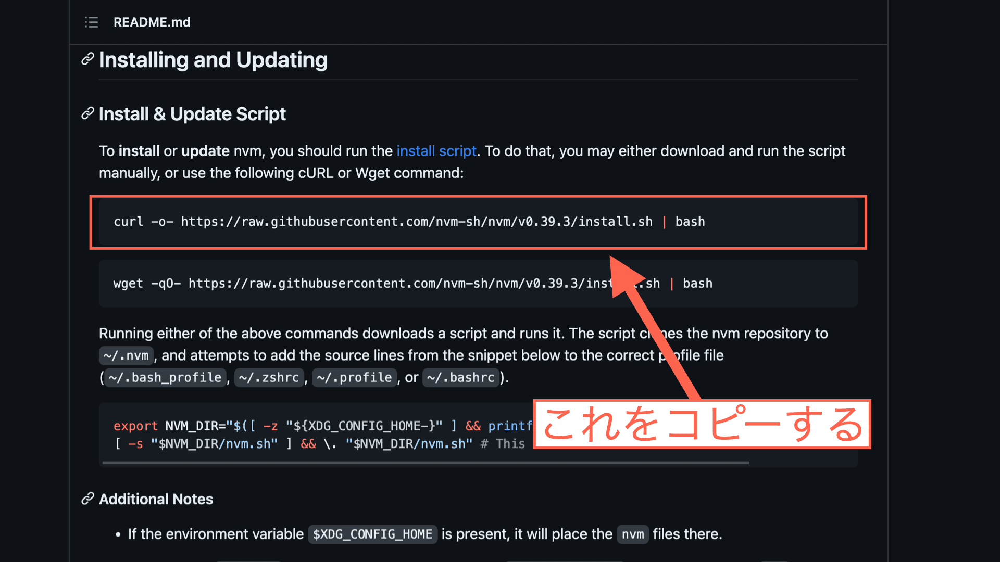

import { Toc } from "../../components/toc.tsx";
import { TocItem } from "../../components/toc-item.tsx";

export const heading100 = "nvmとは";
export const heading200 = "nvmをインストールする";
export const heading300 = "nvmを使ってNode.jsをインストールする";
export const heading400 = "nvmを使ってNode.jsのバージョンを切り替える";
export const heading500 = "nvmをアンインストールするには";

「**MacでNode.jsをインストールしたい**」と考えている方向けの記事です。

MacでNode.jsをインストールするなら、「**nvm**」を使うのがおすすめですよ。なぜなら、「**Node.jsの管理が楽だから**」です。

Node.jsは、公式サイトから直接インストールすることもできます。でも、後でNode.jsの「**バージョン管理**」が面倒になってきます。

そこで、nvmを使えば**Node.jsのバージョン管理が楽で早い**です。

この記事では、nvmを使ってMacにNode.jsをインストールする方法を解説します。

<Toc client:load>
	<TocItem>[{heading100}](#heading100)</TocItem>
	<TocItem>[{heading200}](#heading200)</TocItem>
	<TocItem>[{heading300}](#heading300)</TocItem>
	<TocItem>[{heading400}](#heading400)</TocItem>
	<TocItem>[{heading500}](#heading500)</TocItem>
</Toc>

## {heading100}

nvmは、「**Node Version Manager**」の略です。

Node.jsの公式サイトにアクセスすることなく、Node.jsをインストール可能。さらに、複数のバージョンのNode.jsをインストールできます。

そして、Node.jsのバージョンを簡単に切り替えることもできます。

## {heading200}

では、nvmをインストールしましょう。

まずは「**ターミナル**」を開いてください。キーボードの「command + スペースキー」でSpotlight検索を出し、「ターミナル」と入力してEnterを押せばターミナルが開きます。

nvmをインストールする準備をしていきます。ターミナルで、以下のように「echo $SHELL」というコマンドを入力して実行してください。

<div class="code-title">ターミナル</div>

```bash
echo $SHELL
```

「/bin/zsh」か「/bin/bash」のどちらかが表示されると思います。

「/bin/zsh」と表示された方は、以下のコマンドを入力してください。

<div class="code-title">ターミナル</div>

```bash
touch ~/.zshrc
```

「/bin/bash」と表示された方は、以下のコマンドを入力してください。

<div class="code-title">ターミナル</div>

```bash
touch ~/.bashrc
```

上記のコマンドを入力しても、特に何か表示されることはないです。あくまで、nvmをインストールするための準備です。

この辺詳しい方は、ご自分の環境に合わせて設定されてください。

次に以下のリンクをクリックして、「**nvm-shのGitHubページ**」にアクセスしてください。

<p><a href="https://github.com/nvm-sh/nvm#install--update-script" target="_blank">{`>> nvm-shのGitHubページへ`}</a></p>

<figure>
  
</figure>

↑このようなページが開くと思います。もしかしたら、「背景が白色で文字が黒色」になってるかもしれませんが、問題ありません。

「**curl ... | bash**」というコマンドが書かれていますので、これをコピーしてターミナルに貼り付けて実行してください。

一応、同じコマンドを以下にものせておきます。

<div class="code-title">ターミナル</div>

```bash
curl -o- https://raw.githubusercontent.com/nvm-sh/nvm/v0.39.3/install.sh | bash
```

ただ、「v0.39.3」の部分は2023年7月現在のものです。「v0.39.3」の部分は、その時の最新の数字に変化します。

nvm-shのGitHubページにアクセスしてから「curl ... | bash」の部分をコピーして、ターミナルにペーストして実行するのがおすすめです。

「curl ... | bash」のコマンドを実行すると、nvmがインストールされます。

インストールが完了したら、キーボードの「command + "q"」で一度ターミナルを終了させてください。ターミナルを終了させたら、もう一度ターミナルを起動してください。

nvmがインストールされているか確認します。以下のコマンドを実行してください。

<div class="code-title">ターミナル</div>

```bash
command -v nvm
```

「nvm」と表示されたら、nvmが正しくインストールされています。

## {heading300}

nvmを使ってNode.jsをインストールしていきます。ターミナルを起動させておいてください。

Node.jsには色々なバージョンがあります。バージョンの中にも「**推奨バージョン**」というものがあります。

Node.jsの「最新バージョン」をインストールしてもいいですが、バグが発生しやすいと言われています。そのため「**推奨バージョン**」をインストールしておいた方が無難です。

ここでは、nvmを使ってNode.jsの推奨バージョンをインストールしていきます。ターミナルで以下のコマンドを実行すると、Node.jsの推奨バージョンがインストールされます。

<div class="code-title">ターミナル</div>

```bash
nvm install --lts
```

「**--lts**」は「Long Term Support」の意味で、「推奨バージョン」を指します。バージョンを指定しなくても、自動でNode.jsの推奨バージョンがインストールされます。

Node.jsの推奨バージョンは日々更新されます。上記のコマンド「nvm install --lts」は定期的に実行した方がいいです。

Node.jsのインストールが完了したら、本当にインストールされたか確認します。ターミナルに以下のコマンドを入力して、実行してください。

<div class="code-title">ターミナル</div>

```bash
node -v
```

Node.jsのバージョンを表す数字が表示されたかと思います。

以上で、nvmを使ったNode.jsのインストールが完了しました。これで、Node.jsを使った開発ができます。

この記事の主な内容としてはこれで終わりです。ですが、ここからおまけの内容として以下についても解説していきます。

- nvmを使ってNode.jsのバージョンを切り替える
- nvmをアンインストールするには

ご興味のある方は、この後も読み進めてください。

## {heading400}

nvmを使えば、**複数のバージョンのNode.js**をインストールできます。さらに、Node.jsのバージョンを**切り替える**こともできます。

前の項では「推奨バージョン」のNode.jsをインストールしました。

**2023年7月現在**の時点では、Node.jsの推奨バージョンは「**v18.16.1**」が最新です。これを確認するには、以下のコマンドを実行します。

<div class="code-title">ターミナル</div>

```bash
nvm ls-remote --lts
```

Node.jsの推奨バージョンがたくさん表示されたと思います。

実はNode.jsの推奨バージョンはいくつも存在します。ここでは例として、別の推奨バージョンのNode.jsをインストールしていきます。

まず準備として、ターミナルに以下のコマンドを入力して実行してください。

<div class="code-title">ターミナル</div>

```bash
nvm ls
```

すると以下のように表示されたかと思います。

<div class="code-title">ターミナル</div>

```bash
->     v18.16.1
         system
default -> lts/* (-> v18.16.1)
iojs -> N/A (default)
unstable -> N/A (default)
node -> stable (-> v18.16.1) (default)
stable -> 18.16 (-> v18.16.1) (default)
lts/* -> lts/hydrogen (-> v18.16.1)
lts/argon -> v4.9.1 (-> N/A)
lts/boron -> v6.17.1 (-> N/A)
lts/carbon -> v8.17.0 (-> N/A)
lts/dubnium -> v10.24.1 (-> N/A)
lts/erbium -> v12.22.12 (-> N/A)
lts/fermium -> v14.21.3 (-> N/A)
lts/gallium -> v16.20.1 (-> N/A)
lts/hydrogen -> v18.16.1
```

後半の方に「**lts/〜**」と何個か書かれています。「**lts**」は「推奨バージョン」のことです。

ターミナルの表示を見ると、一つ前の推奨バージョンは「v16.20.1」です。以下のコマンドをターミナルに入力して実行すると、Node.jsのv16.20.1がインストールされます。

<div class="code-title">ターミナル</div>

```bash
nvm install lts/gallium
```

または

<div class="code-title">ターミナル</div>

```bash
nvm install 16.20.1
```

本当にインストールされたか確認します。以下のコマンドをターミナルに入力して実行してください。

<div class="code-title">ターミナル</div>

```bash
nvm ls
```

すると、以下のように表示されると思います。途中は略してあります。

<div class="code-title">ターミナル</div>

```bash
->     v16.20.1
       v18.16.1
         system
...略...
```

今、Node.jsのv16.20.1とv18.16.1がインストールされている状態です。

さらに、「-> v16.20.1」と表示されているので、Node.jsのバージョンはv16.20.1が適用されていることがわかります。

次に、Node.jsのバージョンを切り替えてみましょう。以下のコマンドをターミナルに入力して実行してください。

<div class="code-title">ターミナル</div>

```bash
nvm use v18.16.1
```

すると、以下のように表示されます。

<div class="code-title">ターミナル</div>

```bash
Now using node v18.16.1 (npm v9.5.1)
```

Node.jsのバージョンが「v18.16.1」に切り替わりました。本当に切り替わったか確認します。

以下のコマンドを入力して実行してください。

<div class="code-title">ターミナル</div>

```bash
nvm ls
```

すると、以下のように表示されます。

<div class="code-title">ターミナル</div>

```bash
       v16.20.1
->     v18.16.1
         system
...略...
```
「-> v18.16.1」と表示されているので、Node.jsのバージョンはv18.16.1が適用されていることがわかります。

「v16.20.1」はそのまま残しておいても問題ありません。「不要だな...」と思う場合は、消すこともできます。

以下のコマンドを実行してください。

<div class="code-title">ターミナル</div>

```bash
nvm uninstall 16.20.1
```

これで「v16.20.1」は削除されます。nvmを使ってNode.jsのバージョンを切り替える方法は以上です。

## {heading500}

nvmは簡単にアンインストールできます。

「間違って共用のパソコンにnvmをインストールしてしまった...」なんて時も心配ありません。

まず、以下のコマンドをターミナルに入力して実行してみてください。

<div class="code-title">ターミナル</div>

```bash
nvm
```

文字がたくさん表示されたと思います。一番最後の方には、以下のように書かれているかと思います。

<div class="code-title">ターミナル</div>

```bash
...略...
Note:
  to remove, delete, or uninstall nvm - just remove the `$NVM_DIR` folder (usually `~/.nvm`)
```

簡単に言うと、「nvmをアンインストールするには$NVM_DIRを削除してね」と書かれています。「**{`$NVM_DIR`}**」は環境変数で、通常は「~/.nvm」というディレクトリを指します。

そこで、まず「~/.nvm」というディレクトリが存在するか確認します。以下のコマンドをターミナルに入力して実行してください。

<div class="code-title">ターミナル</div>

```bash
echo $NVM_DIR
```

すると以下のように表示されます。

<div class="code-title">ターミナル</div>

```bash
/Users/(yourname)/.nvm
```

「(yourname)」の部分はお使いのパソコンによって違います。「/.nvm」で終わっていれば「**/.nvmというディレクトリが存在しているということ**」なので、問題ありません。

では、「~/.nvm」というディレクトリを削除していきます。以下のコマンドを入力して実行してください。

<div class="code-title">ターミナル</div>

```bash
rm -rf $NVM_DIR
```

これで、nvmがアンインストールされました。上記のコマンドを実行しても特に何も表示されません。

一度、ターミナルを「command + "q"」で終了させてください。その後ターミナルを起動させてください。

nvmが本当にアンインストールされたか確認します。以下のコマンドをターミナルに入力して実行してください。

<div class="code-title">ターミナル</div>

```bash
command -v nvm
```

nvmをアンインストールしたので何も表示されないと思います。これで、確実にnvmがアンインストールされていることがわかります。

ただ、nvmは一度アンインストールしてしまうと、nvmを使ってインストールしたNode.jsも消えてしまうのでご注意ください。

nvmを一度アンインストールしても、本記事冒頭の「nvmをインストールする」の手順に従って進めていただければもう一度nvmをインストールすることもできます。

というわけで、記事は以上です。